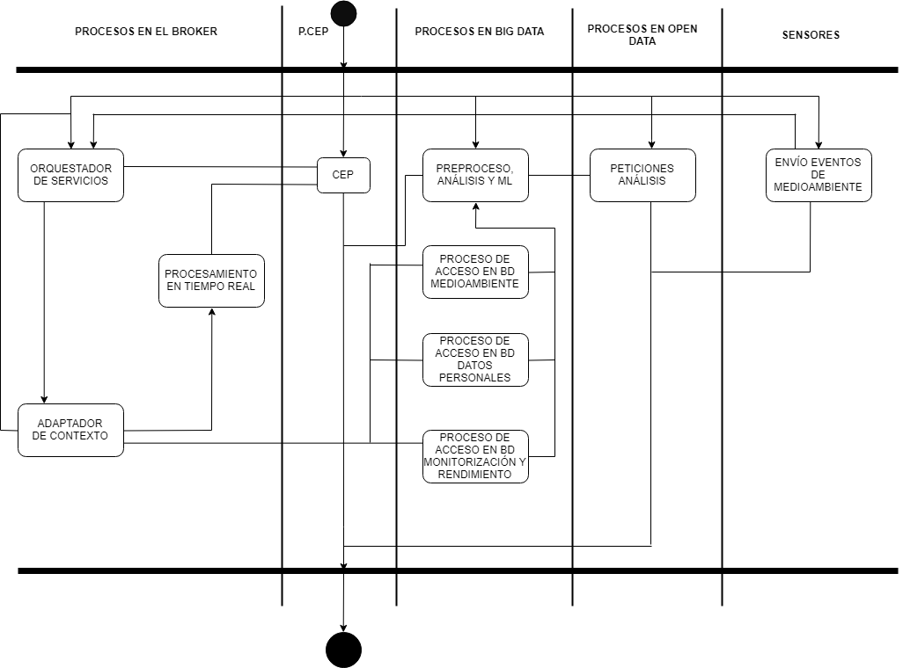

---
title: "Documentación de una arquitectura"
titlepage: "True"
date: 02-04-2019
author: [Luis Mata Aguilar, María Gallego Martín, Daniel Rodriguez Manzanero, Yeray Granada Layos, Carlos Gómez Robles, Alejandro de la Fuente Perdiguero]
logo: "Logo-ETSISI-2.png"
...

# Documentando la Arquitectura

## 1. Introducción

### 1.1 Descripción general del problema

En Madrid, desde el 1 de febrero de 2016, se han implantado protocolos de actuación debido a la contaminación atmosférica, situándose ésta como un [problema de salud pública](https://diario.madrid.es/blog/2016/02/03/la-contaminacion-atmosferica-un-grave-problema-de-salud-publica/) en el que se invierten una cantidad desmesurada de recursos.

Se propone la construcción de un sistema eHealth en el contexto de Madrid entendida como una ciudad inteligente, teniendo en cuenta el Plan de acción sobre la salud electrónica 2012-2020: atención sanitaria innovadora para el siglo XXI (Comisión europea).

Para conciliar las ideas propuestas en dicho plan, el sistema pretende facilitar el trato con pacientes permitiendo consultas mediante vía telemática; diagnóstico remoto de enfermedades con perfil establecido; tratamiento de enfermedades terminales o crónicas así como monitoreo de las mismas mediante el uso de tecnologías IoT; avisos de rigesgos de salud pública con un sistema de alertas personalizables (alérgenos, nivel de contaminación); categorización y estudio de enfermedades a nivel de población, de forma que la investigación se vea explícitamente favorecida.

En cuanto a las comunicaciones telemáticas, el sistema contará con aplicaciones cliente a las que los ciudadanos podrán conectarse y ligar a su centro médico o seguro sanitario. En caso de tratarse de un paciente que requiera de un seguimiento personalizado, obtendrá una extensión del cliente, que le permitirá, junto con un pequeño equipo de sensores IoT, ser susceptible de monitoreo y seguimiento por los especialistas médicos que le estén tratando. Mejorando de esta forma la calidad de vida tanto del paciente terminal o crónico como la del doctor especialista, elevando la sostenibilidad de recursos públicos de Madrid en sanidad, así como de recursos humanos en centros médicos y hospitales.

En caso de haber parámetros en el seguimiento de estos pacientes fuera del rango esperado, se categoriza la urgencia de la anomalía y en caso de ser urgente, una ambulancia (ahora equipada con dispositivos IoT que las conecten al sistema) se dirigirá a la ubicación del sensor. Los datos, anomalías e incidencias serán comprobados a varios niveles de redundancia para resolver cualquier tipo de inconsistencia.

### 1.2 Business Goals

- **1.** Resolver las dudas sanitarias de cualquier ciudadano de Madrid vía telemática, lo cual incluye:
    - **1.1** Respuestas automáticas de dudas puntuales con características específicas.
    - **1.2** Consultas personales con un doctor por medios telemáticos en su jornada laboral y dentro de ciertos horarios.

- **2.** Monitoreo y seguimiento para pacientes que tengan establecida una extensión del sistema para el control de enfermedades crónicas o de tratamiento continuado mediante dispositivos IoT, incluye:
    - Para datos que salgan del rango permitido en el monitoreo:
        - **2.1** Urgentes: Sistema sincronizado de ambulancias para atender la emergencia.
        - **2.2** No urgentes: Derivan en alertas a médico especialista y al usuario para que concerte la cita (telemática o no).

- **3.** Como doctor se podrá acceder a los datos de seguimiento de los pacientes crónicos para observaciones periódicas sin necesidad de verles personalmente(a no ser que vea algo extraño, en ese caso envía una notificación al usuario para que concerte cita), siendo necesario sin embargo una consulta personal cada cierto tiempo según convenga.

- **4.** Alertas informativas a todos los usuarios sobre el entorno saludable de Madrid, incluye:
    - Niveles de contaminación atmosférica por zonas.
    - Niveles de contaminación auditiva por zonas.
    - Niveles de alérgenos **personalizados** en la ciudad.

- **5.** Información y estadísticas derivadas del uso del servicio por todos los usuarios del sistema (respetando la LOPD, serán datos no personales). Se pretende ayudar a la investigación de enfermedades y tratamientos así como respuesta al entorno por parte de la ciudad para analizar situaciones de salud pública. De forma que los médicos especialistas así como instituciones pertinentes que dispongan de autorización, puedan ver estos resultados para realizar I+D+i sobre salud pública.

- **6.** Para probar y lanzar el sistema se considera una user base de 50.000 usuarios lo cual corresponde con aproximadamente 1/60 de la población de Madrid. A partir de la cual el sistema irá optimizando y escalando a su uso real. Por ello tenemos la necesidad también de monitorizar el sistema.

### 1.3 Business Drivers

1. Para cualquier usuario autenticado como paciente con su tarjeta de sanidad nacional, podrá realizar consultas sanitarias de dos tipos. Unas personales y otras no personales.
    - a. Las personales se procesarán en una cola con prioridades en función de la urgencia (derivada a partir de los síntomas expuestos por el paciente). Si la consulta revisada, es aceptada, se procede a enlazar una comunicación en tiempo real con un medico especialista y dicho paciente. Una vez terminada, se archiva el historial de consulta así como otros parámetros afectados y terminan las comunicaciones.
    - b. Las no personales se activan mediante un formulario con parámetros a rellenar como la temperatura corporal, tensión arterial, ... Añadiendo un campo para que los pacientes puedan expresar libremente sus síntomas. Este formulario se procesa automáticamente para buscar valores fuera de rango y así establecer una prioridad. Más tarde, un equipo de médicos especializados en este tipo de consultas, la revisarán y decidirán su tratamiento así como sí es necesario, dependiendo de la prioridad y el tipo de síntomas, una atención médica presencial.

2. Para el monitoreo y seguimiento de pacientes crónicos o terminales, se les otorgará los dispositivos IoT de seguimiento. Estos pacientes deben autenticarse en el sistema (el cual los tiene previamente a su uso clasificados) y además de las funcionalidades de los pacientes comunes, tienen un apartado de monitorización en el que figura su historial de seguimiento hecho con el dispositivo IoT y que se actualiza en tiempo real. Para la actualización de dicho historial se pueden dar estos casos:
    - 2.1 Los datos recibidos del dispositivo IoT son normales (con lo cual el sistema no tiene que reaccionar de ninguna forma aparte de actualizar el historial).
    - 2.2 Los datos recibidos del dispositivo IoT son anómalos. En este caso dependerá de la urgencia de las anomalías observadas:
        - 2.2.1 Urgentes: estos generarán una alerta en el sistema que hará que el CEP (Complex Event Processing) lo procese inmediatamente (ya que es prioritario, en tiempo real y dirigido por eventos) y genere un evento que haga mandar una ambulancia al domicilio del paciente.
        - 2.2.2 No urgentes: estos datos no generarán una alerta urgente en el sistema, si no que simplemente debe informar al paciente de la anomalía encontrada, para que pueda concertar su cita, y al médico especialista.
    - 2.3 No se han recibido datos del dispositivo IoT. En este caso se enviará una notificación al usuario informando de que no se ha realizado la monitorización.Si en un periodo de tiempo definido no se han recibido aún los datos se generará una alerta en el sistema que hará que el CEP la procese y cree un evento que indicará la urgencia de contactar con el usuario a través del número de contacto. En el caso de no obtener respuesta, se generaría otra alerta que el CEP tendría que procesar para contactar con la persona de contacto de dicho paciente.

3. El médico accederá al historial de seguimiento del paciente crónico a través de la base de datos del Big Data,  seleccionando el mismo. Si este ve algún dato extraño puede generar una alerta para que se notifique al usuario la necesidad de una consulta.

4. El sistema podrá suministrar a los pacientes información relativa a los niveles de contaminación y los niveles de alérgenos de la ciudad. Con la colaboración del Ayuntamiento de Madrid (que será nuestro servidor) y, gracias a los sensores IoT implantados en la ciudad, proporcionados por el anterior, podremos recoger toda la información relevante para nuestro servicio. Una vez obtenidos dichos datos y almacenados en la base de datos de nuestro sistema, podremos mostrarlos en la aplicación de forma que todos los pacientes tengan acceso a los niveles de contaminación atmosférica y auditiva y, en el caso de que el usuario padezca alguna alergia, dicho usuario podrá personalizar la información para obtener, además de la información general proporcionada, datos de interés para su alergia.
El sistema también enviará notificaciones a los pacientes en caso de niveles que superen los límites permitidos establecidos por la Agencia Europea del Medio Ambiente.

5. Para esto el sistema procesará los datos no personales en el servidor Big Data y los desplegará sobre la plataforma Open-Data donde los usuarios podrán usarlos en investigación. Para ello se ha considerado [CKAN](https://ckan.org/).

6. Para probar y lanzar el sistema se considera una user base de 50.000 usuarios lo cual corresponde con aproximadamente 1/60 de la población de Madrid. A partir de la cual el sistema irá optimizando y escalando a su uso real. Para ello dispone en el servidor Big Data de un componente que se encarga de monitorizar el desempeño del sistema y detectar puntos críticos.

## 2. Stakeholders

**Gurpos de prioridad** | **Stakeholder** | **Descripción** 
 --- | --- | --- 
 **Grupo de prioridad 1** | Paciente crónico (paciente con seguimiento de enfermedad crónica),especialistas sanitarios y emergencias (sistema automatizado de ambulancias) | Usuarios críticos y más importantes del sistema.
 **Grupo de prioridad 2** | Paciente común (pacientes sin seguimiento de enfermedad crónica) y médicos de consulta | Usuarios importantes pero sin necesidad de urgencia ni total disponibilidad.
 **Grupo de prioridad 3** | Instituciones sanitarias (públicos y/o privados) y Comunidad de Madrid | Aprueban el uso del sistema.
 **Grupo de prioridad 4** | Equipo desarrollo y mantenimiento Software | Encargados del mantenimiento y correcto funcionamiento del sistema.
 **Grupo de prioridad 5** | Empresa encargada de la recogida de información relativa a los índices de calidad de vida en la ciudad | Añaden información al sistema para mejorar la vida de los usuarios.
 **Grupo de prioridad 6** | Equipo de marketing y ventas | Distribuyen información para fomentar la implantación del sistema y su uso.

## 3. Atributos de calidad

Para el orden de prioridad se ha usado la técnica de **dote-voting**.

1. **Disponibilidad**: Nuestro sistema necesita estar operativo para ofrecer un buen servicio a nuestros usuarios, disponemos de 2 tipos de disponibilidad:
     - Disponibilidad siempre operativa: para pacientes con seguimiento de enfermedad crónica en tiempo real, necesitaremos que el sistema esté operativo 24/7/365
     - Disponibilidad limitada: para el resto de pacientes que son gestionados por el sistema, tendremos una franja horaria para el uso de la aplicación.
2. **Usabilidad**: Como nuestro sistema está diseñado para cualquier tipo de usuario (edad, discapacidad…) deberá ser lo más simple y fácil de usar.
3. **Seguridad**: Los datos de todos los usuarios de la aplicación deben estar cifrados y la información debe estar protegida cumpliendo la LOPD.
4. **Interoperabilidad**: Las distintas partes de la aplicación deberán estar integradas entre ellas correctamente y compartir datos de unas a otras.
5. **Rendimiento**: Nuestro sistema tiene que funcionar con tiempos de respuestas cortos consiguiendo una eficiencia excelente.
6. **Escalabilidad**: Se necesita que nuestro sistema soporte una gran carga de usuarios y datos.
7. **Portabilidad**: La aplicación sea usable en cualquier dispositivo y sistema.
8. **Mantenibilidad**: El sistema debe mantenerse en el tiempo sin reducir su rendimiento y sus funciones.
9. **Modificabilidad**: El sistema debe soportar modificaciones manteniendo su integridad..

### 3.1 Descripción de los atributos de calidad más importantes y su priorización justificada

### 3.2 Árbol de utilidad

 Atributo de calidad       | Atributo refinado          | ASR 
---| --- | ---
 **Disponibilidad** | Aplicación siempre operativa | Los pacientes tipo 1 necesitan que la aplicación esté siempre operativa para el seguimiento de la enfermedad crónica de forma que en todo momento se conozca el estado de los pacientes (H,H)
 \- | Aplicacion Limitada | Los pacientes tipo 2 tendrán limitados a un horario el uso de la aplicación para consultas con los médicos. (H,H)
 \- | Sistema crítico | Como de la aplicación dependen vidas humanas, debemos mantener un plan alternativo en caso de un fallo crítico del sistema.  (H,H)
 \- | Datos de los pacientes | Como la aplicación toma decisiones usando los parámetros de los pacientes, los dispositivos de los pacientes deben estar actualizando sus parámetros en la base datos y a su vez la base de datos debe estar disponible para que los especialistas sanitarios puedan leer esta información. (H,H)
**Usabilidad** | Facilidad de uso | Necesidad de que la aplicación sea fácilmente entendible e intuitiva para todo tipo de usuarios. (H,M)
**Seguridad** |   Integridad de los datos   |   Como cliente necesito que la seguridad de los datos (tanto de los pacientes como de los especialistas) sea íntegra para evitar problemas con los usuarios. (H,H)
 \- | Restricción al acceso de los datos | Como cliente necesito que exista una restricción al acceso de los datos para aumentar la seguridad de la aplicación y de los usuarios. (H,M)
 **Interoperabilidad** | comunicacion e integracion de las partes del sistema | las diferentes partes del sistema deben comunicarse entre sí para funcionar correctamente y compartir datos (H,M)
 **Portabilidad** | Disponibilidad en distintos sistemas operativos y dispositivos |  Como cliente necesito que la aplicación sea usable en cualquier dispositivo independientemente del sistema operativo utilizado.   (M,M)
 **Mantenibilidad** | Cambios en el sistema | Como cliente necesito que se puedan realizar cambios para poder mejorar la aplicación. (M,M)
 **Rendimiento** | Funcionalidad correcta en tiempos de respuesta y de ejecución cortos | La aplicación deberá funcionar con una respuesta rápida entre sus módulos. (H,M)
 **Escalabilidad** | Soporte de varios usuarios simultaneamente | El sistema deberá soportar que grandes cantidades de usuarios accedan simultáneamente sin problema y con alto rendimiento. (M,L)
 **Modificabilidad** | Actualización de los parámetros recogidos de los pacientes | Como cliente necesito que el sistema pueda actualizar los datos de los pacientes. (M,M)
 \- | Actualización de los parámetros que establecen los especialistas sanitarios | Se actualizará la información relativa a tratamientos, medicamentos, fármacos…(M,M)
 \- | Actualización de los niveles de contaminación y alérgenos | El sistema tiene que ser capaz de actualizar la información referente a los niveles de contaminación y alérgenos de la ciudad. (M,M)

## 4. Vistas arquitectónicas

Ahora vamos a mostrar cada vista correspondiente al modelo de vistas arquitectónicas 4+1 de Philippe Krunchten.
Hemos obtenido cada vista del modelo Krunchten de un modelo conceptual a mayor nivel de abstracción para poder integrar cada parte. En él se puede reconocer el uso de patrones arquitectónicos que más adelante se plasmarán en todas las vistas según corresponda. En concreto podemos hablar del Brooker de contexto, que será cuello de botella de nuestro sistema ya que se encargará de la orquestación de servicios y datos; o de la arquitectura dirigida por eventos del sistema de procesamiento de eventos complejo que se encargará de capturar eventos de emergencia detectados en el Brooker.

### 4.1 Vista lógica

#### 4.1.1 Descripción

La vista lógica proporciona la base para comprender la estructura y la organización del diseño del sistema. Muestra las clases existentes y la forma de interactuar entre ellas, implementando así los requisitos funcionales del sistema. Cabe destacar que esta vista es mejorable en las distintas iteraciones. 

#### 4.1.2 Notación

Hemos representado la vista lógica mediante un diagrama de clases (especificando solo los nombres de las clases y las interacciones entre sí), en la que los símbolos representan:

    
 
     
 
     
 
    
- Multiplicidad entre clases:
    - 1,1 : Uno y solo uno
    - 0,1 : Cero o uno
    - 0,n : Cero o varios
    - 1,n : Uno o varios (al menos uno)

#### 4.1.3 Vista

#### 4.1.4 Catálogo

En el diagrama se pueden observar 14 clases distintas:

- **USUARIO**: representa todo el conjunto de usuarios que van a utilizar el sistema.
- **MEDICO**: representa el tipo de usuario médico, que van a ser los médicos que trabajen en cada centro de salud que utilice el sistema.
- **PACIENTE**: representa el tipo de usuario paciente, que van a ser todos los tipos de paciente que tenga cada centro sanitario que implante el sistema.
- **PACIENTE_CRÓNICO**: representa el tipo de paciente paciente crónico, que serán todos aquellos pacientes de cada centro de salud que utilice el sistema que por motivos de salud requieran un seguimiento periódico.
- **HISTORIAL**: esta clase contiene el historial médico de cada paciente de la base de datos.
- **CENTRO_SANITARIO**: esta clase contiene los distintos centros médicos que figuran en la base de datos.
- **CONSULTA**: esta clase está formada por los dos tipos de consulta que pueden realizar los pacientes.
- **PERSONAL**: esta clase está formada por las consultas de tipo personal que realicen los pacientes que usen la aplicación.
- **NO_PERSONAL**: esta clase está formada las consultas de tipo no personal que realicen los pacientes a través del sistema. 
- **SENSOR_IOT**: esta clase está compuesta por todos los dispositivos IoT asignados a cada paciente crónico para su monitorización.
- **HISTORIAL_MONITORIZACION**: esta clase la forman los historiales de monitorización de todos los pacientes crónicos que utilizan el sistema.
- **ALERTA**: esta clase engloba todas las alertas “no urgentes” que se generan en el sistema y que interactúan de alguna forma con otras clases.
- **ALERTA_URGENTE**: esta clase está formada por todas las alertas urgentes que generan los dispositivos IoT de seguimiento de pacientes crónicos.
- **AMBULANCIA**: en esta clase se guardan los datos de las ambulancias de cada centro médico (que al estar conectadas a la red se utilizarán como dispositivos IoT en beneficio del sistema).

#### 4.1.5 Rationale

- **Disponibilidad**: este QA ha afectado a nuestra vista haciendo del todo necesaria una diferenciación entre pacientes comunes y pacientes crónicos, ya que estos últimos van a necesitar una total disponibilidad del sistema en caso de urgencia.
- **Usabilidad**: para mejorar la usabilidad hemos reducido todo lo posible el número de funciones que pueden realizar los pacientes.
- **Rendimiento**: hemos creado un sistema de alertas para agilizar el procesado de tareas urgentes y la simplificación de las tablas otorga una mayor eficiencia a la hora de consultarlas.

### 4.2 Vista de procesos

#### 4.2.1 Descripción

#### 4.2.2 Notación

#### 4.2.3 Vista

#### 4.2.4 Catálogo

#### 4.2.5 Rationale

### 4.3 Vista de desarrollo 

#### 4.3.1 Descripción

En ella se tratan los componentes y archivos que se han usado para hacer posible el sistema físico de la aplicación. Gracias a ello, se ayuda a controlar las configuraciones de las distintas versiones del sistema.

#### 4.3.2 Notación

#### 4.3.3 Vista

#### 4.3.4 Catálogo

#### 4.3.5 Rationale

## 4.4 Vista de despliegue

#### 4.4.1 Descripción

#### 4.4.2 Notación

#### 4.4.3 Vista

#### 4.4.4 Catálogo

#### 4.4.5 Rationale

### 4.5 Escenarios

#### 4.5.1 Descripción

#### 4.5.2 Notación

#### 4.5.3 Vista

#### 4.5.4 Catálogo

#### 4.5.5 Rationale

## 5. Trazabilidad

### 5.1 Entrevistas

### 5.2 Entre Business Goals y vistas

### 5.3 Entre atributos de calidad y vistas

## 6. Conclusiones

### 6.1 Relativas a la arquitectura

### 6.2 Personales

